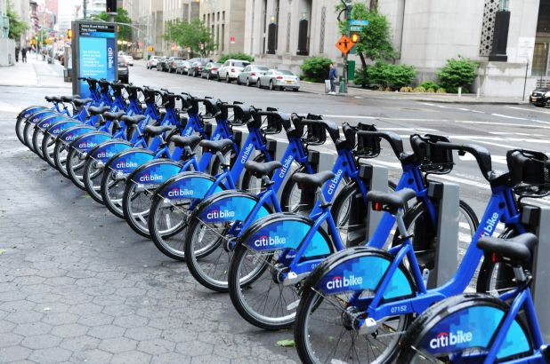

# Citi_Bike_Analytics_Tableau

<h3>Objective:</h3>
To aggregate the data found in the Citi Bike Trip History Logs and find two unexpected phenomena. 

<h3>Data Source:</h3>
https://www.citibikenyc.com/system-data
 
 <h3>Overview:</h3>

Analysed January 2020-May 2020 New York Citi Bike Data using Tableau. 
Dived deep into the data to draw insights regarding two major phenomenons:

 1. Trend of Ridership from Jan 2020-May 2020
 2. Top 10 stations for starting a journey
  
 Created various vizualisations contributing towards explaining each phenonmenon and presented it on a dashboard. Also created a static map plotting different stations marking      them on the basis of their popularity. 
 
 <h4>Trend of Ridership from Jan 2020- May 2020</h4>
 
 
 
 <ul>
 <li>The ridership has increased from 1,240,596 in January 2020 to 1,487,890 in May 2020, although we see that the week wise ridership has decreased from first week of January to last week of May.</li>
 
 <li>Although we see a major drop in the number of rides taken in the month of April, we see that the average trip duration has been increasing. Major drop in the month of April can be due to the lockdown imposed as a safety measure to protect from COVID 19.</li>
 
 <li>The number of annual members i.e. the subscribers have decreased from January to May reason being the lockdown and many office places and schools are now following work from home culture and online classes. At the same time, we see an increase in the number of customers (24-hour pass or 3-day pass users) towards the end of April as slowly relaxations are being imposed on the lockdown and people are coming back to normal life.</li>
 
 <li>Males who contribute to larger percentage to the ridership although show a decrease in number from January to May but the number of female riders show an increasing trend compensating the overall statistics.</li>

 
 </ul>
  
 <h4>Top 10 stations for starting a journey</h4>
 

Link to Tableau workbook: https://public.tableau.com/profile/vaishali.tanwar4784#!/vizhome/CitibikeAnalysis_15931197458450/Trendofridershipobserverdmonth-wise?publish=yes
